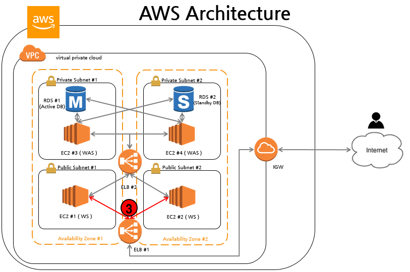

# '-': unordered list

- content-(1)
- content-(2)
- content-(3)


# 'n': ordered list

1. content-(1)
2. content-(2)
3. content-(3)


# emoji (이모지 적용 안됨, 해결책 찾을 것)

:o::o2::ocean::octopus::oden::office::oil_drum::ok::ambulance::baby_chick:

:dagger::qatar::alembic::rabbit::e-mail::first_quarter_moon::eagle:


# image




# quote(인용문)

```
> 이건 인용문이에요.
  >> 이건 인용문 속 인용문이에요.
```


```python
# x, y, z 변수에 값 1, 2, 3을 각각 저장
x, y, z = 1, 2, 3
print(x, y, z)
```

    1 2 3


# h1

## h2

### h3

#### h4

##### h5

###### h6


```python
# Python program to find H.C.F of two numbers

# define a function
def compute_hcf(x, y):

# choose the smaller number
    if x > y:
        smaller = y
    else:
        smaller = x
    for i in range(1, smaller+1):
        if((x % i == 0) and (y % i == 0)):
            hcf = i 
    return hcf

num1 = 54 
num2 = 24

print("The H.C.F. is", compute_hcf(num1, num2))
```

```markdown
코드를 감쌀 경우 백틱을 써서 감쌉니다.
```

```python
# Python Program to find the L.C.M. of two input number

def compute_lcm(x, y):

   # choose the greater number
   if x > y:
       greater = x
   else:
       greater = y

   while(True):
       if((greater % x == 0) and (greater % y == 0)):
           lcm = greater
           break
       greater += 1

   return lcm

num1 = 54
num2 = 24

print("The L.C.M. is", compute_lcm(num1, num2))
```


> 인용문을 사용할 경우, 단축키 [ctrl + shift + Q]를 입력합니다.
>


저의 블로그 링크입니다.

[네이버블로그(yhon89)](https://blog.naver.com/yhon89)

[네이버블로그(yhon89e)](https://blog.naver.com/yhon89e)

[티스토리블로그(#파이썬)](https://jack-channel-python.tistory.com/)

[Velog블로그(#C-series)](https://velog.io/@2170004487z)

[Blex블로그(#CS지식)](https://blex.me/@2170004487z)

[Steemit블로그(#경제#경영#정책)](https://steemit.com/@yunsungwoong)


<cite>Steve Jobs</cite> --- Apple Worldwide Developers' Conference, 1997
{: .small}
