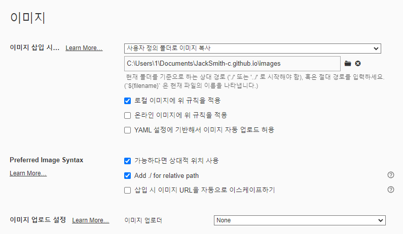

# 1. Header & Sub-Header


※Syntax
```
# This is H1 Header
## This is H2 Header
### This is H3 Header
#### This is H4 Header
##### This is H5 Header
###### This is H6 Header
```
※Result
# This is H1 Header
## This is H2 Header
### This is H3 Header
#### This is H4 Hedaer
##### This is H5 Header
###### This is H6 Headr


# 2. Sub-Header & Under-Line
※Syntax
```
THis is Sub-Header
---

<u>THis is Under-Line</u>
```

※Result

THis is Sub-Header
---

<u>THis is Sub-Header</u>


# 3. Links

※Syntax

```
Link: [구글로 이동](https://www.google.com/webhp?hl=ko&sa=X&ved=0ahUKEwjO18XOw7KDAxUWgFYBHa3-BuwQPAgJ )
```

※Result

Link: [구글로 이동](https://www.google.com/webhp?hl=ko&sa=X&ved=0ahUKEwjO18XOw7KDAxUWgFYBHa3-BuwQPAgJ )


# 4.BlockQuote

※Syntax
```
> 이것은 BlockQuote 입니다.
> 이것은 BlockQuote 입니다.
	> 이것은 BlockQuote 입니다.
	> 이것은 BlockQuote 입니다.
	> 이것은 BlockQuote 입니다.
		> 이것은 BlockQuote 입니다.
		> 이것은 BlockQuote 입니다.
		> 이것은 BlockQuote 입니다.
		> 이것은 BlockQuote 입니다.
```


※Result
> 이것은 BlockQuote 입니다.
> 이것은 BlockQuote 입니다.
>
> > 이것은 BlockQuote 입니다.
> >
> > 이것은 BlockQuote 입니다.
> >
> > 이것은 BlockQuote 입니다.
> >
> > > 이것은 BlockQuote 입니다.
> > >
> > > 이것은 BlockQuote 입니다.
> > >
> > > 이것은 BlockQuote 입니다.
> > >
> > > 이것은 BlockQuote 입니다.


# 5.Ordered List
※Syntax

```
1.ordered list
2.ordered list
3.ordered list
```


※Result

1. ordered list
2. ordered list
3. ordered list


# 6.Unordered List

※Syntax

```
*unordered List
*unordered List
	*unordered List
	*unordered List
		*unordered List
		*unordered List
```


※Result

- - - - - - - - - - - - - - - - - - - -

* unordered List
* unordered List
  * unordered List
  * unordered List
    * unordered List
    * unordered List

- - - - - - - - - - - - - - - - - - - -


# 7.Code Block

※Syntax

```
<pre>
<code>이곳에 코드를 삽입</code>
코드블락을 닫은 후</pre>
```

※Result

<pre>
<code>이곳에 코드를 삽입</code>
코드블락을 닫은 후</pre>


# 8.Syntax-Highlight

#### Case(1)-Python

※Syntax

````
``` python
 # This program adds up integers in the command line
import sys
try:
    total = sum(int(arg) for arg in sys.argv[1:])
    print 'sum =', total
except ValueError:
    print 'Please supply integer arguments'
```
````


※Result

``` python
 # This program adds up integers in the command line
import sys
try:
    total = sum(int(arg) for arg in sys.argv[1:])
    print 'sum =', total
except ValueError:
    print 'Please supply integer arguments'
```


#### Case(2)-C/C++

※Syntax

````
```c
int str_equals(char *equal1, char *eqaul2)
{
   while(*equal1==*eqaul2)
   {
      if ( *equal1 == '\0' || *eqaul2 == '\0' ){break;}
      equal1++;
      eqaul2++;
   }
   if(*eqaul1 == '\0' && *eqaul2 == '\0' ){return 0;}
   else {return -1};
}
```
````


※Result

```c
int str_equals(char *equal1, char *eqaul2)
{
   while(*equal1==*eqaul2)
   {
      if ( *equal1 == '\0' || *eqaul2 == '\0' ){break;}
      equal1++;
      eqaul2++;
   }
   if(*eqaul1 == '\0' && *eqaul2 == '\0' ){return 0;}
   else {return -1};
}
```


# 8.Strikethrough

※Syntax

```
~~ 이것은 취소선 입니다. ~~
```

※Result

~~ 이것은 취소선 입니다. ~~


# 9.Insert Image

Typora에서 [파일]>[환경설정]>[이미지]탭>

다음과 같이 <u>"사용자 정의 폴터로 이미지 복사"</u>를 선택한 후 해당 경로 설정



실제로 이미지를 적용하려면 아래와 같이 상대경로로 잡아주어야 한다.(Typora에디터를 써주면 자동으로 경로설정을 해준다)

```
.png)
```

결과>

.png)

> 참고로 이분은 MNIST데이터셋과 Lenet이라고 하는 CNN의 초기모델을 만드신 "얀르쿤"님이시다.

