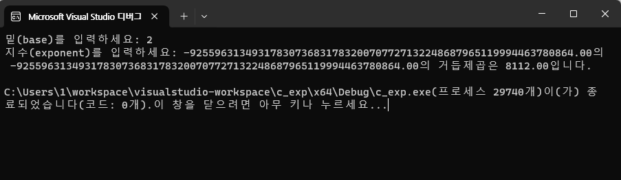
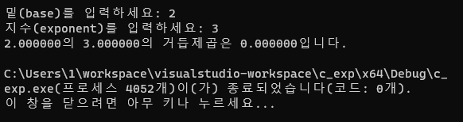

### double과 float, 그리고 %f와 %lf

float로 선언할때는 %f를, double로 선언할 때는 %lf를 사용해야 한다.


※Code
```c
#define _CRT_SECURE_NO_WARNINGS
#include <stdio.h>


int main() {
    double base, exponent, result;

    //사용자로부터 밑(base)과 지수(exponent) 입력받기
    printf("밑(base)를 입력하세요: ");
    scanf("%.1f", &base);
    
    printf("지수(exponent)를 입력하세요: ");
    scanf("%.1f", &exponent);

    //pow() 함수를 사용하여 거듭제곱 계산
    result = pow(base, exponent);

    //결과 출력
    printf("%.2f의 %.2f의 거듭제곱은 %.2f입니다.\n", base, exponent, result);

    return 0;
}

```
※Output



위 코드에서는 double로 선언되었음에도 형식지정자를 %.1f로 써서 소수자리가 제대로 처리가 되지 않은 것 같다.(확실한 이유는 모르겠지만 그냥 받아들이도록 하자)

이번에는 형식지정자를 다시 %lf로 정정해주겠다.

※Code

```c
#define _CRT_SECURE_NO_WARNINGS
#include <stdio.h>


int main() {
    double base, exponent, result;

    //사용자로부터 밑(base)과 지수(exponent) 입력받기
    printf("밑(base)를 입력하세요: ");
    scanf("%lf", &base);
    
    printf("지수(exponent)를 입력하세요: ");
    scanf("%lf", &exponent);

    //pow() 함수를 사용하여 거듭제곱 계산
    result = pow(base, exponent);

    //결과 출력
    printf("%lf의 %lf의 거듭제곱은 %lf입니다.\n", base, exponent, result);

    return 0;
}

```


※Output




### 반복문에서 참일때의 실행이 한줄이면, 중괄호를 써주지 않아도 된다.

예를 들어 다음과 같은 코드가 있으면,

```c
if (count > 0)
{
    count++;
}
```

아래와 같이 치환이 가능하다.

```c
if (count > 0); count++;
```


반대 다음과 같은 코드가 있으면,

```c
if (count > 0); count++;
```

아래와 같이 치환이 가능하다.

```c
if (count > 0)
{
    ;
}
count++;
```

즉 세미콜론(;)하나 더 붙여서 쓸모없는 코드가 되어버렸다.


