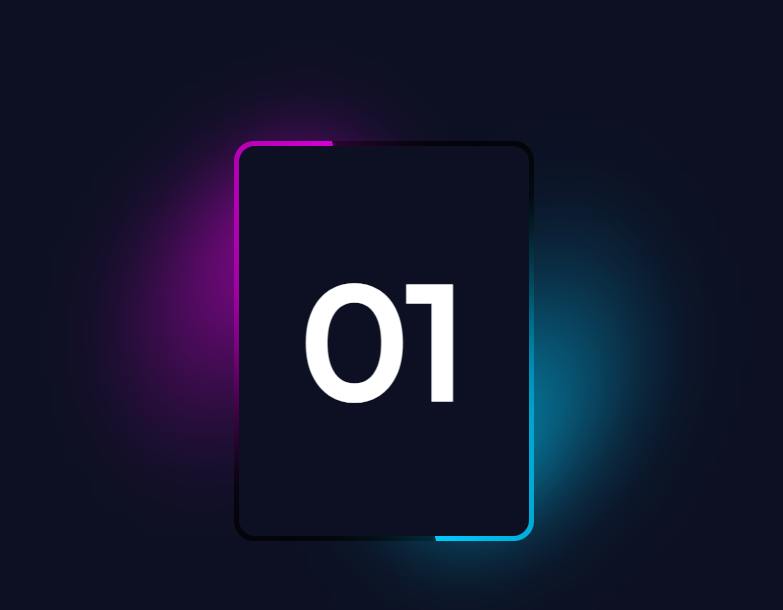
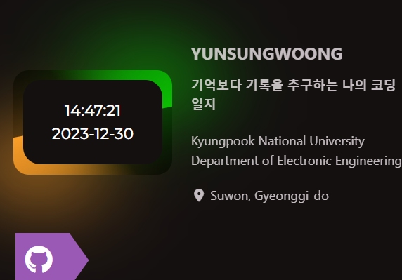

### [CSS]background와 background-color의 차이

현재 내가 제작중인 블로그에서 옆에 사이드바[메뉴]를 제작중이다. 근데 계속 꼬리표 모양이 티톡에 대해서는 깨진다.

이거 이슈를 해결하는 과정에서 스타일을 함수로 처리하는 것도 보았다. 예전에는 이런게 없었는데ㄷㄷ

HTML5까지 올라오면서 이것도 OOP를 조금씩 섞는게 아닌가 하는 생각을 잠깐 해보았다.(틀렸으면 말구~~)

### [HTML]code insert

위 이미지는 해당[링크](https://codepen.io/simonb_Dev/pen/zYebgvX)에서 참고한 코드이다. 이 코드를 이용해서 좌측상단에 시계를 만들어 넣으려고 한다.

그 결과는 다음과 같다.(나름 잘 된거 같다.)

